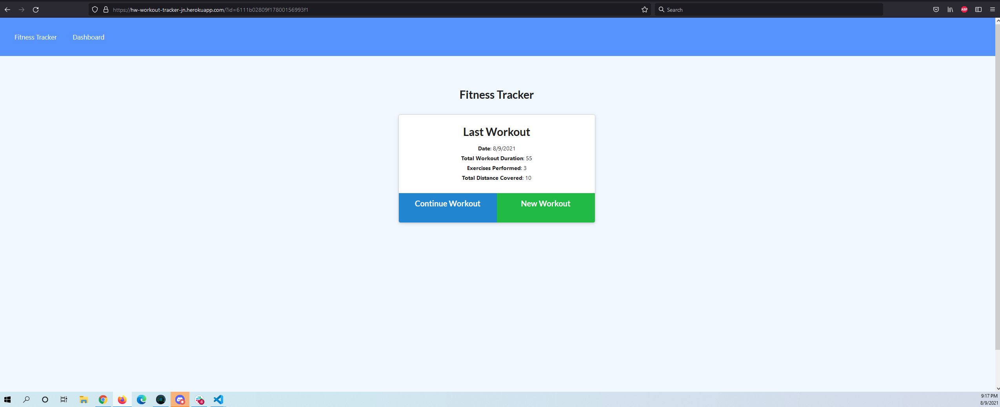

# 18-fitness_tracker
This is the week 18 homework

1.0 Title:
    Workout/Fitness Tracker

2.0 Introduction:
    The goal of this week's homework was to take the starter code provided and launch an app on heroku utilizing the mongodb. 

3.0 Technologies:
    This uses javascript and mongodb. The app on heroku is using MongoAtlas and I'm usuing Robo 3T to be able to connect from my desktop pc.

4.0 Launch:
    The website is located at https://hw-workout-tracker-jn.herokuapp.com/
    The repo is located at https://github.com/speakeasyman/18-fitness_tracker

5.0 My Goals:
    My goal was to get this one over with. Mongodb seems pretty cool with the file structure, however as get along in the class I'm pretty exhausted. I think I like the sql DBs better, but that's because they make more sense to me innately.

6.0 In use:  

Here it is in use, with the latest exercise I added to it.  

